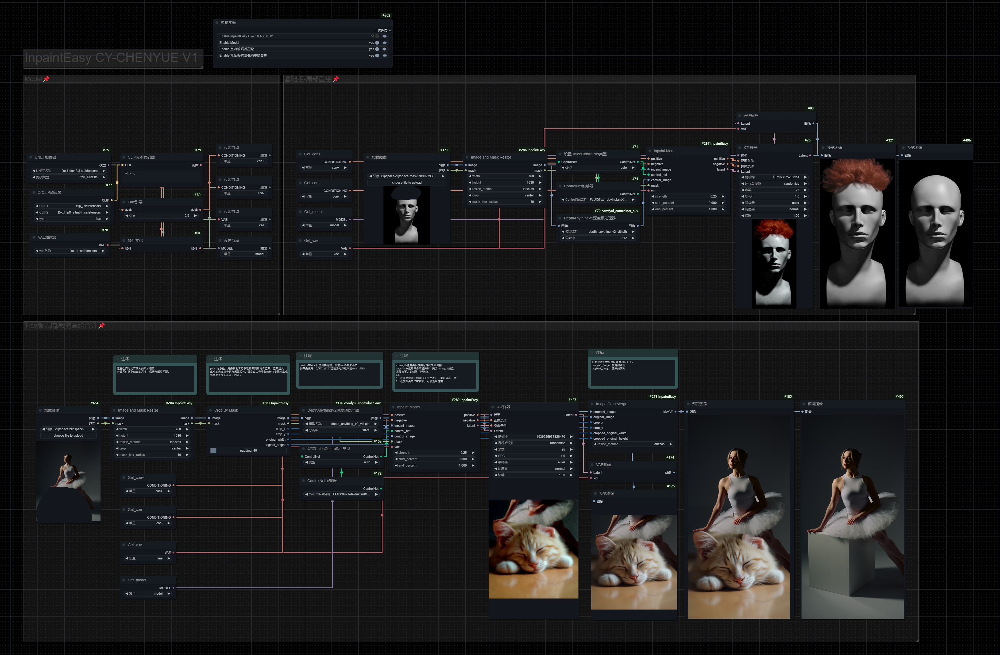

# ComfyUI InpaintEasy 

ComfyUI InpaintEasy是一组优化的局部重绘(Inpaint)节点，提供了更简单和更强大的局部重绘工作流程。通过智能的裁剪和合并功能，让局部重绘工作更加便捷和高效。

## 功能特点

- 一体化的局部重绘模型节点
- 智能裁剪功能，自动检测重绘区域并进行最优裁剪
- 图像和蒙版同步缩放，支持多种缩放算法
- 支持蒙版模糊处理，获得更自然的重绘效果
- 智能合并功能，无缝将重绘结果融合回原图

## 安装方法

1. 打开ComfyUI的`custom_nodes`文件夹
2. 使用以下命令克隆仓库:
```bash
git clone https://github.com/CY-CHENYUE/ComfyUI-InpaintEasy.git
```
## 工作流

## 节点说明

### 1. Inpaint Model
集成了一体化局部重绘模型节点。

输入参数：
- `positive`: 正向提示词条件
- `negative`: 负向提示词条件
- `inpaint_image`: 需要重绘的图像
- `control_net`: ControlNet模型
- `control_image`: ControlNet的输入图像
- `mask`: 重绘蒙版
- `vae`: VAE模型
- `strength`: strength参数，需要根据实际情况来做调整。重绘生成的图像不受控制，提升strength的值。需要有更大的创意，降低值。
eg：
1. 在画面中添加物体（无中生有），值可以小一些。
2. 改变画面中原有物品，可以适当提
- `start_percent`: 控制起始
- `end_percent`: 控制结束

### 2. Image and Mask Resize
同时调整图像和蒙版大小的节点。

输入参数：
- `image`: 输入图像
- `mask`: 输入蒙版
- `width`: 目标宽度 
- `height`: 目标高度 
- `resize_method`: 缩放方法 ["nearest-exact", "bilinear", "area", "bicubic", "lanczos"]
- `crop`: 裁剪方式 ["disabled", "center", "top_left", "top_right", "bottom_left", "bottom_right"]
- `mask_blur_radius`: 蒙版模糊半径 

### 3. Crop By Mask
根据蒙版智能裁剪图像，自动计算最佳裁剪区域。

输入参数：
- `image`: 输入图像
- `mask`: 输入蒙版
- `padding`: 裁剪区域额外边距。padding参数，用来控制重绘获取的画面的内容范围，范围越大，生成的内容就会越与原图相关。但是过大会导致的新内容无法生成也需要更多的显存、内存。


输出：
- `image`: 裁剪后的图像
- `mask`: 裁剪后的蒙版
- `crop_x`: 裁剪区域X坐标
- `crop_y`: 裁剪区域Y坐标
- `original_width`: 原始裁剪宽度
- `original_height`: 原始裁剪高度

### 4. Image Crop Merge
将处理后的裁剪图像智能合并回原始图像。

输入参数：
- `cropped_image`: 裁剪并处理后的图片
- `original_image`: 需要被合并的原始完整图片
- `crop_x`: 裁剪区域X坐标
- `crop_y`: 裁剪区域Y坐标
- `cropped_original_width`: 原始裁剪宽度
- `cropped_original_height`: 原始裁剪高度
- `resize_method`: 缩放方法 ["nearest-exact", "bilinear", "area", "bicubic", "lanczos"]

## 使用建议

1. 建议使用Crop By Mask节点先对重绘区域进行智能裁剪，可以提高处理效率
2. Image and Mask Resize节点在需要调整图像尺寸时很有用，支持多种缩放算法
3. 使用Image Crop Merge节点时，确保输入参数与Crop By Mask节点的输出参数对应
4. 可以通过调整mask_blur_radius参数来获得更自然的边缘过渡效果
5. 遮罩mask需要大一点，让重绘有更多的发挥空间，如果是重绘区域发生比较大的改变，就通过提升权重来进行控制。


